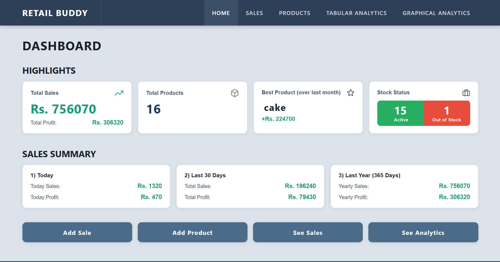
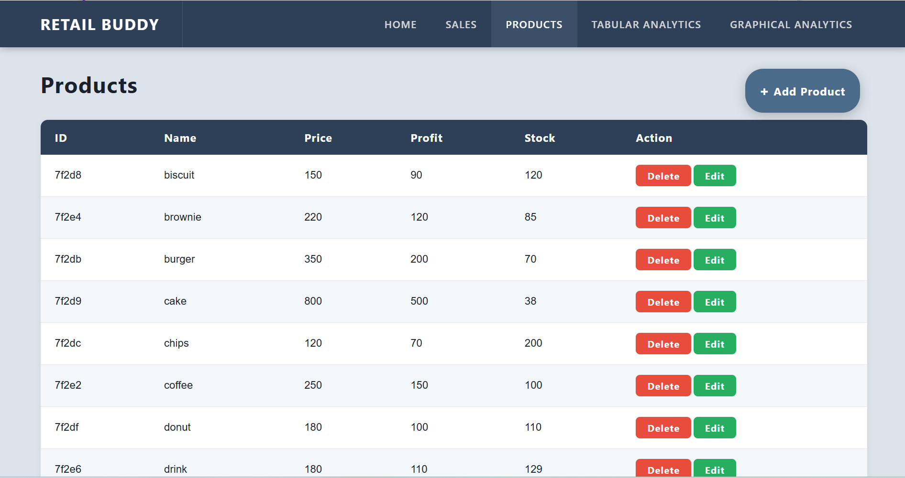
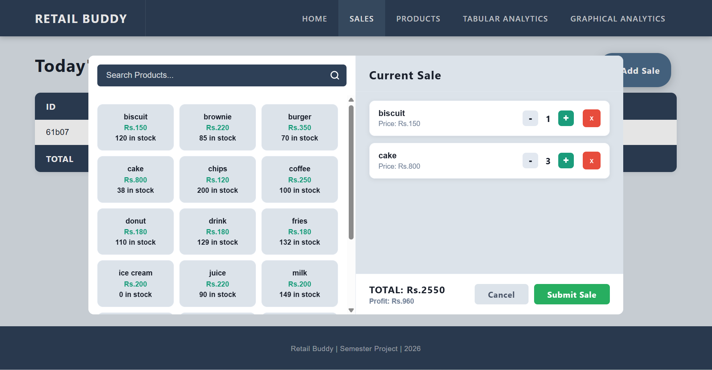
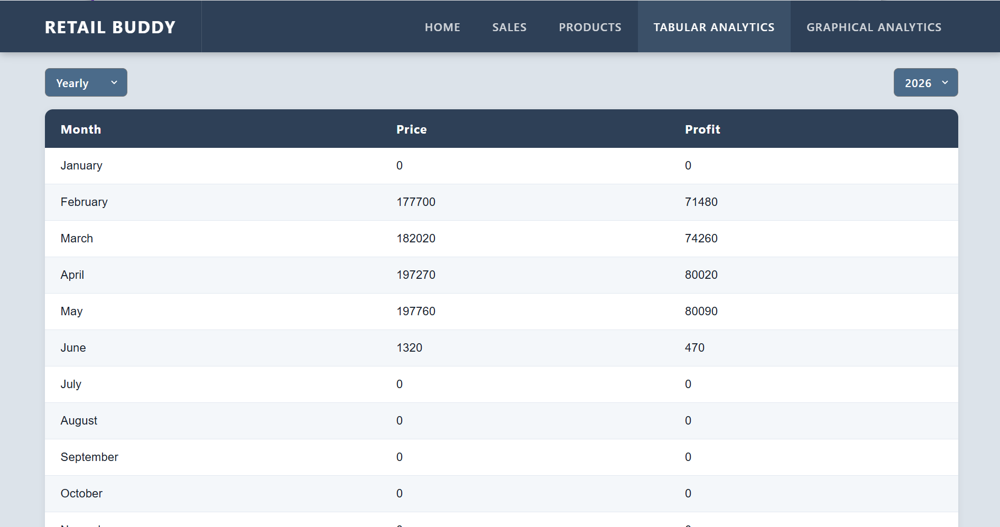
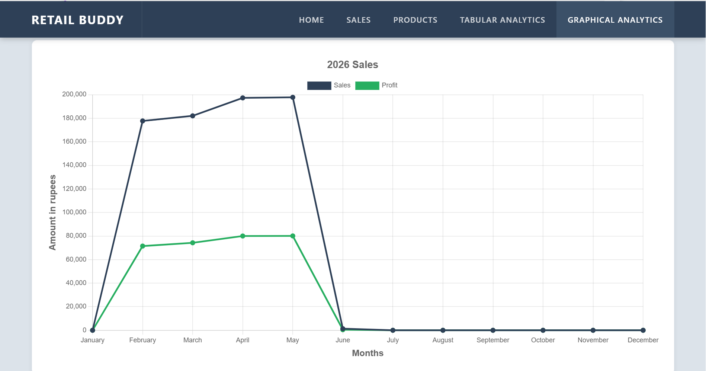

# Retail Buddy

A web-based retail management system for small and local stores to manage inventory, generate sales, and analyze business performance.

## Problem Statement

Many small retail stores still rely on manual methods to track inventory and sales, making it difficult to maintain accurate records and gain insights into business performance.
Retail Buddy aims to digitalize these operations by providing a simple platform for product management, sales generation, and business analytics.

## Tech Stack

### Frontend
- HTML
- CSS
- JavaScript

### Backend
- Node.js
- Express.js

### Database
- MongoDB
- Mongoose

## Features

### Product Management
- Add products
- Edit products
- Delete products
- View product inventory

### Sales Management
- Generate sales transactions
- Maintenance of stock quantities

### Dashboard
- View key business statistics

### Analytics
- View sales analytics through:
  - Tables
  - Graphs

## Getting Started

1. Clone the repository.
2. Install dependencies using `npm install`.
3. Configure the MongoDB connection in the `.env` file.
4. Run the project using `npm start`.
5. Open the application in your browser (local host).

## Screenshots

     

     

     

     

   

## License
MIT LICENSE
This project was developed as part of my Semester project.